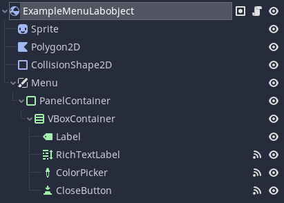
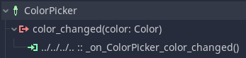
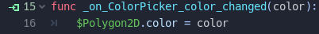

### 1 - Basic LabObject that interacts with others

See Scenes/Objects/GraduatedCylinder.tscn and Scenes/Objects/SourceContainer.tscn as reference.

GraduatedCylinder has a script that implements `try_interact` and SourceContainer is in a group called `Source Container`. It checks if SourceContainer is in either groups `Source Container` or `Container`. This determines the resulting action. In this case, it will prompt to the user to fill the GraduatedCylinder. To try it, drag an instance of GraduatedCylinder onto an instance of SourceContainer.

### 2 - LabObject that opens a Menu

Sometimes you might want to prompt the user for something that a `LabObject` needs to do its job (for example, how long a microwave should heat something for). You can see an example of how you might structure this in Scenes/Objects/Microwave.tscn.

This object has a child called `Menu`.

All of the menu components are children of that node, and it's accessed in the script as `$Menu`.

`Menu` is a type of node called [CanvasLayer](https://docs.godotengine.org/en/4.3/classes/class_canvaslayer.html). It makes sure that its children are drawn as UI, relative to the screen (as opposed to relative to the LabObject itself). If you wanted to, for example, have a button that followed its object around, you would remove the `CanvasLayer` and parent that UI node to the LabObject directly.

Microwave also responds to input in its menu. When you select a button, it can change the time it will heat an object for or start the heating process. To try it, drag a `LabObject` that has the `Heatable` property into this object.

To do things like this, you don't need to follow any particular design (ie. the base class doesn't do it for you). Just connect a signal on the UI element to a function that does what you want to do.

### 3 - LabObject that does something independently

See Scenes/Objects/Spawner.tscn.

This object creates a new instance of a specified object when clicked. It implements `try_interact_independently()`. To try it, just click an instance of the spawner.
