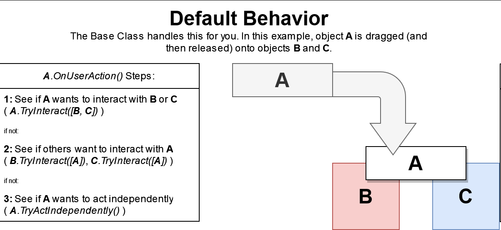
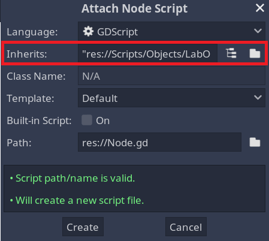
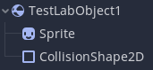
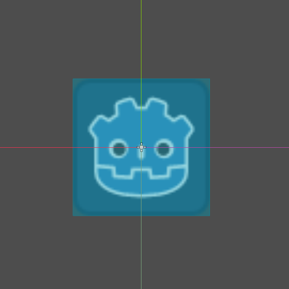

## LabObjects ([see examples](../examples/examples-labobjects.md))

`LabObject` is the base class for any objects that need to interact with others or be moved around the scene. For example, pipettes, containers, and anything else that exists in the lab should inherit from `LabObject`.

**Inherited By:** SubsceneManager

### Properties

- `draggable` tells a `LabObject` whether it should be possible to drag it around the screen.
- `can_change_subscenes` controls whether this object can be dragged from one subscene (see SubsceneManagers) to another. If false, this object will stop dragging when the mouse leaves the subscene that it is a child of (they will not act independently or interact when this happens, i.e. `on_user_action()` is not called).
- `display_name` should contain the name of the object that should be shown to the user. If this is not empty, the base class will automatically create and manage a tooltip with this as its text.

If a `LabObject` is `draggable`, it will try to interact with any objects it's overlapping with when it is released. If it is not draggable, it will try to interact when it is clicked.

All `LabObject`s are part of the `LabObject` group. They take care of that on their own. You should add them to other groups depending on what they are capable of, so that other objects know how to interact with them. See [here](/docs/reference/groups/index.md) for what those are and how they should be used..

### Functions

#### Simulation Functionality
- `clamp_object_position()`: This function checks if the current module scene has a LabBoundary node. If it does, it prevents the `LabObject`'s global position from being outside of `x_bounds` and `y_bounds` of that LabBoundary. This function is called when the `LabObject` is dragging.
- `try_interact(others: Array[LabObject]) -> bool`: This function checks if this object would like to interact with any of the objects in `others`, and if so, does that interaction. Returns whether it chose to interact. This is a virtual function, and it is called automatically by the child class (in `on_user_action()`, see below). Override this function in your child classes if they need to interact with others. See Example 1 below for how you can do that.
- `try_act_independently() -> bool`: This function checks if this object would like to do anything that does not require another object, and if so, does that thing. Returns whether it chose to do something. This is a virtual function, and it is called automatically by the child class (in `on_user_action()`, see below). Override this function in your child classes if they need to, for example, open a menu when clicked. See Example 2 or Example 3 below for how you can do that.
- `on_user_action()`: This function is called for you when the user releases a `draggable` LabObject, or when they click a non draggable one. It decides which of the above functions to call in what order, and it is NOT virtual. In the base class, it does this:  You can override this function in a child class if you have a reason for needing different behavior. **Note:** The base class keeps track of how far a LabObject has been dragged from where it started, and only calls `try_act_independently()` if it has not been dragged very far. This way, objects generally won't try to do things without the user explicitly wanting them to do so by either clicking them, or dragging them onto another object.
- `report_action(objects_involved: Array, action_type: String, params: Dictionary)`: This function calls `check_action()` for the current module scene and the main scene.
- `dispose()`: Called when the LabObject is disposed of, for example by putting it in a trashcan. This exists (and you can override it) because some objects need to decide what to do in that situation based on things that only they know. For example, when put over a trashcan, a pipette might want to throw its tip away, instead of itself.

#### Convenience Functions
These functions do the same things as the corresponding Godot functions. The base LabObject class uses some of these functions, and it needs them to work, and we've had issues with people forgetting to call `super()`.

*Please* use these instead of the built in functions like `_ready()` and `_process()`. If you're just doing a basic object, they'll work exactly the same, and it'll prevent mistakes and keep everything nicely organized.
- `lab_object_ready()`: called by the base class in Godot's built in `_ready()` function.
- `lab_object_process(delta: float)`: called by the base class in Godot's built in `_process(delta)` function.
- `lab_object_physics_process(delta: float)`: called by the base class in Godot's built in `_physics_process(delta)` function.
- `lab_object_enter_tree()`: called by the base class in Godot's built in `_enter_tree()` function.
- `lab_object_exit_tree()`: called by the base class in Godot's built in `_exit_tree()` function.

### Creating a new type of LabObject

You need to create a new Scene, whose type is Godot's RigidBody2D class (or something that extends it), and give it a new script for your child class.

When you create a new script, tell it to inherit from LabObject.



Your object is going to need some child nodes in order to do anything:

- Something visible on the screen (like a `Sprite2D`)
- A collision (like a `CollisionShape2D`).



You can add multiple of each if you'd like. The collision is necessary so that the game knows when your object has been clicked, when other objects are touching it, etc. In the editor, you'll need to edit the `shape` property of your collision. You probably want to make it cover the entire area that the visible area does, something like this:




If your object needs to initiate any kind of interaction (so, if it needs to do something when clicked or when dragged onto another object), it should override `try_interact(others)`. The base class calls that function for you. `others` is a list of all the other objects that your object has the option to interact with. It does not need to interact with any of them (for example, a pipette shouldn't interact with another pipette if it's the only option). It should probably only ever interact with one other object at once, and then stop. For how this can go you can look at Example 1 below, and the LabObjects section above.

***Note:*** The base LabObject class uses Godot's `_ready()` and `_process()` functions to do its job, so if you override those, its functionality will break. To prevent this, use the corresponding Convenience Functions listed above. In most cases, they'll work exactly the same.

If for some reason you do need to give your custom LabObject a `_ready()` or `_process(delta)` function, make sure to call the base class function so it continues to work. In Godot 4.3, you do that like this:
```gdscript
func _ready() -> void:
    super()
```
