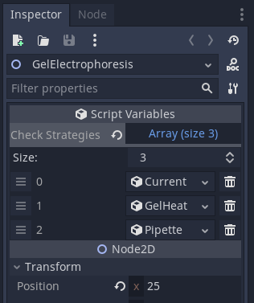

## Mistake Checkers
This refers to validating user actions against what is expected and considered correct in a lab.
## Types of Errors
In the simulation, there are a variety of possible things to check for, though they tend to resolve to two categories: general and lab-specific. 
### General
These may include configuring the `CurrentSource` wires incorrectly. This is something that a `LabObject` should be aware of and let the user know of their mistake. Since the `LabObject` is aware of these errors, it should call `LabLog` instead functions instead of `report_action()`. 
### Lab-Specific
These include issues that are relevant to a specific lab. For instance, the run time of the gel in the Gel Electrophoresis module should not be something a `LabObject` like the `CurrentSource` or `ElectrolysisSetup` should be aware of. As a result, it is recommended to call `report_action()` instead of calling `LabLog` directly. This allows for easier maintenance as you won't have to keep adding potential errors for each module you each the object to.
## Implementation
The general structure relies on the Strategy Design Pattern where each separate `MistakeChecker` type implements the base `MistakeChecker` class.
### `MistakeChecker` functions
- `check_action(params: Dictionary)`: checks the action based off the parameters sent by `report_action()`. It should compare the `action_type` of `params` to determine whether it should do anything. It then should send a `LabLog` log, warn, or error depending on the requirements.

For example, say we need to verify the heat time of an agarose and TAE buffer solution for creating a gel in the Gel Electrophoresis module.

Within the `check_action` function, we first check if the `action_type` is `'heat'` and that the parameter `heat_time` exists.

If the `heat_time` is less than the ideal value defined (e.g. 60 seconds), we use the LabLog `Warn` function to give a message indicating the time was too short.

In the opposite case, we give a message saying the heat time was too long.

### `MistakeChecker` resource
To add a `MistakeChecker` to a lab module or even to the main scene so that it acts as a universal checker, it is necessary to create a resource. Once created, it is added to the `Check Strategies` array of the scene.

As an example, refer to the image below.

